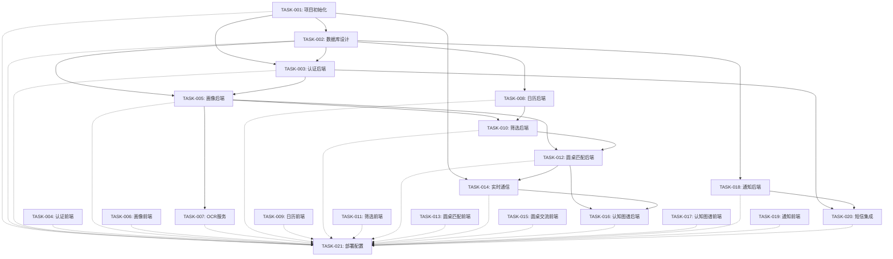

# PROJ-E-001：畅选日历 MVP 1.0 - 项目计划 v1

## 文档元信息

| 项目 | 内容 |
|------|------|
| EPIC_ID | E-001 |
| 状态 | DRAFT |
| 创建日期 | 2026-03-04 17:54 |
| 关联文档 | `TECH-E-001-v1.md`, `TASK-DEPENDENCIES.md`, `TASK-001~021.md` |

---

## 1. 项目概述

### 1.1 目标

**业务目标**（引用 biz-overview）：
1. 验证学生愿意来（获取）
2. 验证学生愿意用（参与）
3. 验证用了有帮助（效果）

**技术目标**：
1. 构建可扩展的 Web 应用架构，支持后续迁移至小程序/App
2. 确保数据安全，第一批用户原始数据永久保留
3. 实现高可用的实时通信系统（圆桌讨论）
4. 建立完善的可观测性体系（埋点、日志、监控）

### 1.2 范围

**本期 Must Have**：
- 用户身份认证（STORY-001）
- 用户画像建立（STORY-002）
- 机会发现核心（STORY-003）
- 精准筛选匹配（STORY-004）
- 同频人匹配（STORY-005）
- 圆桌深度交流（STORY-006）
- 成长可视化（STORY-007）
- 全流程通知（STORY-008）

**本期 Won't Have**：
- 雇主端、合作伙伴端
- 完整 8 步解锁（仅第 1-2 步）
- 简历生成器、AI 面试官

### 1.3 成功标准

| 指标 | 目标 | 测量方式 |
|------|------|----------|
| 页面加载时间 | <= 3秒 | Lighthouse |
| API 响应时间 | <= 1秒 (P95) | APM |
| 服务可用性 | >= 99.5% | 监控系统 |
| 测试覆盖率 | >= 70% | Jest/Vitest |

---

## 2. 任务清单

### 2.1 任务总览

| Task ID | Task Name | Story | 优先级 | 预估工时 | 状态 | BEADS_ID |
|---------|-----------|-------|--------|----------|------|----------|
| TASK-001 | 项目初始化与基础架构 | - | P0 | 2天 | TODO | [待填写] |
| TASK-002 | 数据库设计与初始化 | - | P0 | 1天 | TODO | [待填写] |
| TASK-003 | 认证服务后端 | STORY-001 | P0 | 2天 | TODO | [待填写] |
| TASK-004 | 认证服务前端 | STORY-001 | P0 | 2天 | TODO | [待填写] |
| TASK-005 | 用户画像后端 | STORY-002 | P0 | 2天 | TODO | [待填写] |
| TASK-006 | 用户画像前端 | STORY-002 | P0 | 2天 | TODO | [待填写] |
| TASK-007 | OCR 服务集成 | STORY-002 | P0 | 1天 | TODO | [待填写] |
| TASK-008 | 日历核心后端 | STORY-003 | P0 | 2天 | TODO | [待填写] |
| TASK-009 | 日历核心前端 | STORY-003 | P0 | 3天 | TODO | [待填写] |
| TASK-010 | 筛选匹配后端 | STORY-004 | P0 | 2天 | TODO | [待填写] |
| TASK-011 | 筛选匹配前端 | STORY-004 | P0 | 2天 | TODO | [待填写] |
| TASK-012 | 圆桌匹配后端 | STORY-005 | P0 | 2天 | TODO | [待填写] |
| TASK-013 | 圆桌匹配前端 | STORY-005 | P0 | 1天 | TODO | [待填写] |
| TASK-014 | 实时通信服务 | STORY-006 | P0 | 3天 | TODO | [待填写] |
| TASK-015 | 圆桌交流前端 | STORY-006 | P0 | 3天 | TODO | [待填写] |
| TASK-016 | 认知图谱后端 | STORY-007 | P1 | 2天 | TODO | [待填写] |
| TASK-017 | 认知图谱前端 | STORY-007 | P1 | 2天 | TODO | [待填写] |
| TASK-018 | 通知系统后端 | STORY-008 | P0 | 2天 | TODO | [待填写] |
| TASK-019 | 通知系统前端 | STORY-008 | P0 | 1天 | TODO | [待填写] |
| TASK-020 | 短信通知集成 | STORY-008 | P0 | 1天 | TODO | [待填写] |
| TASK-021 | 部署与运维配置 | - | P0 | 2天 | TODO | [待填写] |

**总预估工时**：36天

### 2.2 Story -> Task 对齐表

| Story ID | Story Name | Task ID | 任务类型 | 本期纳入 |
|----------|------------|---------|----------|----------|
| STORY-001 | 用户身份认证 | TASK-003, TASK-004 | 后端+前端 | Yes |
| STORY-002 | 用户画像建立 | TASK-005, TASK-006, TASK-007 | 后端+前端+OCR | Yes |
| STORY-003 | 机会发现核心 | TASK-008, TASK-009 | 后端+前端 | Yes |
| STORY-004 | 精准筛选匹配 | TASK-010, TASK-011 | 后端+前端 | Yes |
| STORY-005 | 同频人匹配 | TASK-012, TASK-013 | 后端+前端 | Yes |
| STORY-006 | 圆桌深度交流 | TASK-014, TASK-015 | WebSocket+前端 | Yes |
| STORY-007 | 成长可视化 | TASK-016, TASK-017 | 后端+前端 | Yes |
| STORY-008 | 全流程通知 | TASK-018, TASK-019, TASK-020 | 后端+前端+短信 | Yes |
| - | 基础设施 | TASK-001, TASK-002, TASK-021 | 初始化+部署 | Yes |

---

## 3. 依赖关系图

### 3.1 硬依赖关系（Mermaid）



### 3.2 依赖关系详细表

| Task ID | 硬依赖 (deps) | 接口依赖 (interface_deps) | 说明 |
|---------|---------------|---------------------------|------|
| TASK-001 | 无 | 无 | 所有任务的基础设施依赖 |
| TASK-002 | TASK-001 | 无 | 需要数据库连接配置 |
| TASK-003 | TASK-001, TASK-002 | 无 | 需要 DB 表和基础框架 |
| TASK-004 | TASK-001 | TASK-003 | 可按接口契约并行开发 |
| TASK-005 | TASK-002, TASK-003 | 无 | 需要 users 表和认证中间件 |
| TASK-006 | TASK-001, TASK-004 | TASK-005 | 可按接口契约并行开发 |
| TASK-007 | TASK-005 | 无 | 需要用户画像 API |
| TASK-008 | TASK-002 | 无 | 需要 events 表 |
| TASK-009 | TASK-001, TASK-004 | TASK-008 | 可按接口契约并行开发 |
| TASK-010 | TASK-005, TASK-008 | 无 | 需要用户偏好和事件数据 |
| TASK-011 | TASK-009 | TASK-010 | 可按接口契约并行开发 |
| TASK-012 | TASK-005, TASK-010 | 无 | 需要用户偏好和筛选逻辑 |
| TASK-013 | TASK-009 | TASK-012 | 可按接口契约并行开发 |
| TASK-014 | TASK-001, TASK-012 | 无 | 需要基础框架和圆桌分组数据 |
| TASK-015 | TASK-013 | TASK-014 | 可按接口契约并行开发 |
| TASK-016 | TASK-012, TASK-014 | 无 | 需要圆桌数据和消息记录 |
| TASK-017 | TASK-015 | TASK-016 | 可按接口契约并行开发 |
| TASK-018 | TASK-002 | 无 | 需要 notifications 表 |
| TASK-019 | TASK-004, TASK-015 | TASK-018 | 可按接口契约并行开发 |
| TASK-020 | TASK-003, TASK-018 | 无 | 需要验证码和通知服务 |
| TASK-021 | TASK-001~020 | 无 | 需要所有服务完成 |

---

## 4. 并行开发路线

### 4.1 阶段划分

```
阶段 1：基础设施 (Week 1)
    TASK-001 (项目初始化) --> TASK-002 (数据库设计)

阶段 2：认证模块 (Week 1-2)
    TASK-003 (认证后端)
        |
        +-- [接口依赖] --> TASK-004 (认证前端) [可并行]
        |
        +-- [硬依赖] --> TASK-005 (画像后端)

阶段 3：核心功能 (Week 2-4)
    TASK-005 (画像后端) --> TASK-006 (画像前端) [接口依赖，可并行]
        |
        +-- TASK-008 (日历后端) --> TASK-009 (日历前端) [接口依赖，可并行]
        |       |
        |       +-- TASK-010 (筛选后端) --> TASK-011 (筛选前端) [接口依赖，可并行]
        |               |
        |               +-- TASK-012 (圆桌匹配后端)
        |
        +-- TASK-007 (OCR) [可与 TASK-008 并行]
        |
        +-- TASK-018 (通知后端) [可与 TASK-008~012 并行]

阶段 4：圆桌与通信 (Week 5-7)
    TASK-012 (圆桌匹配后端)
        |
        +-- [接口依赖] --> TASK-013 (圆桌匹配前端) [可并行]
        |
        +-- TASK-014 (实时通信) --> TASK-015 (圆桌交流前端) [接口依赖，可并行]
                |
                +-- TASK-016 (认知图谱后端) --> TASK-017 (认知图谱前端) [接口依赖，可并行]

阶段 5：完善闭环 (Week 8)
    TASK-018 (通知后端) --> TASK-019 (通知前端) [接口依赖，可并行]
        |
        +-- TASK-020 (短信集成)

    TASK-021 (部署配置)
```

### 4.2 可并行任务组

| 阶段 | 可并行任务 | 说明 |
|------|------------|------|
| 阶段 2 | TASK-003, TASK-004 | 认证前后端可并行（接口契约先行） |
| 阶段 3 | TASK-005, TASK-006 | 画像前后端可并行 |
| 阶段 3 | TASK-008, TASK-009 | 日历前后端可并行 |
| 阶段 3 | TASK-007, TASK-008 | OCR 与日历后端可并行 |
| 阶段 3 | TASK-018, TASK-008 | 通知后端与日历后端可并行 |
| 阶段 3 | TASK-010, TASK-011 | 筛选前后端可并行 |
| 阶段 4 | TASK-012, TASK-013 | 圆桌匹配前后端可并行 |
| 阶段 4 | TASK-014, TASK-015 | 实时通信与圆桌交流前端可并行 |
| 阶段 4 | TASK-016, TASK-017 | 认知图谱前后端可并行 |
| 阶段 5 | TASK-018, TASK-019 | 通知前后端可并行 |

### 4.3 关键路径

**最长硬依赖链**（影响整体进度）：

```
TASK-001 --> TASK-002 --> TASK-003 --> TASK-005 --> TASK-010 --> TASK-012 --> TASK-014
```

**关键路径工时**：2 + 1 + 2 + 2 + 2 + 2 + 3 = 14天

**建议**：优先保障这条链路的开发资源

---

## 5. 里程碑规划

### 5.1 里程碑定义

| 里程碑 | 目标日期 | 关键交付物 | 完成定义 (DoD) |
|--------|----------|------------|----------------|
| M1: 基础设施就绪 | Week 1 | TASK-001, TASK-002 | 前后端项目可启动，数据库连接正常 |
| M2: 认证模块完成 | Week 2 | TASK-003, TASK-004 | 用户可登录/注册，Token 管理正常 |
| M3: 核心功能完成 | Week 4 | TASK-005~011 | 用户画像、日历、筛选功能可用 |
| M4: 圆桌功能完成 | Week 7 | TASK-012~017 | 圆桌匹配、实时通信、认知图谱可用 |
| M5: MVP 上线 | Week 8 | TASK-018~021 | 全功能可用，生产环境部署完成 |

### 5.2 Gate 检查点

**Gate A（进入实现前）**：
- [x] PRD-E-001-v1.md（可开发版）
- [x] 至少 1 个"厚 STORY"
- [x] 至少 1 个 SLICE（竖切闭环）
- [ ] UI 证据（原型/截图/录屏）- [待确认]

**Gate B（P0 Task 进入 DONE 前）**：
- [ ] 对应 AC 的测试用例与结果
- [ ] 至少一次"真数据真流程"的端到端验证
- [ ] 回滚方案 + 上线观测点

**Gate C（发生方向偏差时）**：
- [ ] PRD/TECH/PROJ 升版本并记录变更点
- [ ] 受影响的 TASK 必须重排

---

## 6. 风险与缓解措施

### 6.1 技术风险

| 风险 | 等级 | 影响 | 应对预案 |
|------|------|------|----------|
| 数据丢失 | 高 | 用户数据永久丢失 | 多级备份 + 异地容灾 |
| 实时通信不稳定 | 中 | 圆桌功能不可用 | 断线重连机制，消息持久化 |
| 圆桌凑不齐 6 人 | 高 | 用户体验差 | 匹配时间窗口放宽，提供备选方案 |
| OCR 识别率低 | 低 | 用户需手动输入 | 优化识别算法 + 降级手动 |

### 6.2 进度风险

| 风险 | 等级 | 影响 | 应对预案 |
|------|------|------|----------|
| 接口契约变更 | 中 | 前后端联调返工 | 使用 TypeScript 类型定义共享契约 |
| 关键路径延期 | 高 | 整体进度延期 | 优先保障关键路径资源 |
| 第三方服务故障 | 中 | 功能不可用 | 多服务商备份（短信/OCR） |

### 6.3 资源风险

| 风险 | 等级 | 影响 | 应对预案 |
|------|------|------|----------|
| 开发人员不足 | 中 | 进度延期 | 接口依赖任务并行开发 |
| 服务器预算未批 | 低 | 部署延期 | 提前申请，准备云服务商方案 |

---

## 7. beads 依赖设置命令

### 7.1 创建 beads 任务（示例）

```bash
# 创建 TASK-001
bd create "TASK-001: 项目初始化与基础架构" -d "搭建项目的基础架构" -p 0 -e 120 -l "E-001,infrastructure"

# 创建 TASK-002
bd create "TASK-002: 数据库设计与初始化" -d "设计并创建数据库表结构" -p 0 -e 60 -l "E-001,database"

# ... 其他任务类似
```

### 7.2 设置硬依赖

```bash
# TASK-002 依赖 TASK-001
bd dep add <TASK_002_BEADS_ID> <TASK_001_BEADS_ID>

# TASK-003 依赖 TASK-001 和 TASK-002
bd dep add <TASK_003_BEADS_ID> <TASK_001_BEADS_ID>
bd dep add <TASK_003_BEADS_ID> <TASK_002_BEADS_ID>

# TASK-005 依赖 TASK-002 和 TASK-003
bd dep add <TASK_005_BEADS_ID> <TASK_002_BEADS_ID>
bd dep add <TASK_005_BEADS_ID> <TASK_003_BEADS_ID>

# TASK-007 依赖 TASK-005
bd dep add <TASK_007_BEADS_ID> <TASK_005_BEADS_ID>

# TASK-008 依赖 TASK-002
bd dep add <TASK_008_BEADS_ID> <TASK_002_BEADS_ID>

# TASK-010 依赖 TASK-005 和 TASK-008
bd dep add <TASK_010_BEADS_ID> <TASK_005_BEADS_ID>
bd dep add <TASK_010_BEADS_ID> <TASK_008_BEADS_ID>

# TASK-012 依赖 TASK-005 和 TASK-010
bd dep add <TASK_012_BEADS_ID> <TASK_005_BEADS_ID>
bd dep add <TASK_012_BEADS_ID> <TASK_010_BEADS_ID>

# TASK-014 依赖 TASK-001 和 TASK-012
bd dep add <TASK_014_BEADS_ID> <TASK_001_BEADS_ID>
bd dep add <TASK_014_BEADS_ID> <TASK_012_BEADS_ID>

# TASK-016 依赖 TASK-012 和 TASK-014
bd dep add <TASK_016_BEADS_ID> <TASK_012_BEADS_ID>
bd dep add <TASK_016_BEADS_ID> <TASK_014_BEADS_ID>

# TASK-018 依赖 TASK-002
bd dep add <TASK_018_BEADS_ID> <TASK_002_BEADS_ID>

# TASK-020 依赖 TASK-003 和 TASK-018
bd dep add <TASK_020_BEADS_ID> <TASK_003_BEADS_ID>
bd dep add <TASK_020_BEADS_ID> <TASK_018_BEADS_ID>

# TASK-021 依赖所有任务（需要等所有完成后再设置）
```

### 7.3 接口依赖（不设置 beads 依赖）

以下任务为接口依赖，**不设置 beads 硬依赖**，允许并行开发：

- TASK-004 <-> TASK-003（认证前端 <-> 认证后端）
- TASK-006 <-> TASK-005（画像前端 <-> 画像后端）
- TASK-009 <-> TASK-008（日历前端 <-> 日历后端）
- TASK-011 <-> TASK-010（筛选前端 <-> 筛选后端）
- TASK-013 <-> TASK-012（圆桌匹配前端 <-> 圆桌匹配后端）
- TASK-015 <-> TASK-014（圆桌交流前端 <-> 实时通信）
- TASK-017 <-> TASK-016（认知图谱前端 <-> 认知图谱后端）
- TASK-019 <-> TASK-018（通知前端 <-> 通知后端）

**验证约定**：后端任务完成后，立即进行接口联调测试

---

## 8. 接口依赖验证约定

### 8.1 验证时间点

| 后端任务 | 接口依赖任务 | 验证时间点 | 验证方式 |
|----------|-------------|-----------|---------|
| TASK-003 | TASK-004 | TASK-003 完成后立即 | 接口联调测试 |
| TASK-005 | TASK-006 | TASK-005 完成后立即 | 接口联调测试 |
| TASK-008 | TASK-009 | TASK-008 完成后立即 | 接口联调测试 |
| TASK-010 | TASK-011 | TASK-010 完成后立即 | 接口联调测试 |
| TASK-012 | TASK-013 | TASK-012 完成后立即 | 接口联调测试 |
| TASK-014 | TASK-015 | TASK-014 完成后立即 | 接口联调测试 |
| TASK-016 | TASK-017 | TASK-016 完成后立即 | 接口联调测试 |
| TASK-018 | TASK-019 | TASK-018 完成后立即 | 接口联调测试 |

### 8.2 桩实现规范

**允许使用桩实现（Stub）**：
- 空实现但类型签名对齐
- 用于让编译通过
- 不提供假数据

**禁止使用 Mock 数据**：
- 禁止在桩实现中返回假数据
- 禁止使用 `jest.fn().mockReturnValue()` 等模拟数据
- 后期联调会导致大量问题

---

## 9. 待确认事项

| 问题 | 负责人 | 状态 | 预计确认时间 |
|------|--------|------|--------------|
| 招聘数据接口格式 | 数据对接负责人 | 待确认 | [TBD] |
| OCR 服务商选择（百度/阿里云） | 技术负责人 | 待确认 | [TBD] |
| 短信服务商选择 | 技术负责人 | 待确认 | [TBD] |
| 服务器预算审批 | 金主 | 待确认 | [TBD] |
| UI 设计稿 | 设计师 | 待开始 | [TBD] |
| beads 任务创建 | proj agent | 待执行 | [TBD] |

---

## 10. 变更记录

| 版本 | 日期 | 变更内容 | 作者 |
|------|------|----------|------|
| v1 | 2026-03-04 17:54 | 初始版本，基于 TECH 和 TASK-DEPENDENCIES 创建 | proj agent |

---

## 附录 A：开发提交流程（生命线）

**正确顺序**：

1. 完成代码 + 更新 TASK 文档
2. 标记 beads 状态为 `DOING`
3. **停止！不要 commit！**
4. 通知 proj 安排 tech review
5. 等待 tech review 通过
6. review 通过后，执行 Git Commit（引用 TASK-ID）
7. 标记 beads 状态为 `DONE`

**违反流程的后果**：
- 代码需要重新 review
- 可能需要返工
- 不符合 DoD（Definition of Done）

---

## 附录 B：测试要求

- [ ] 检查测试基建是否就绪
- [ ] 单元测试覆盖率目标：70%
- [ ] 真数据真流程验证
- [ ] 接口联调测试通过